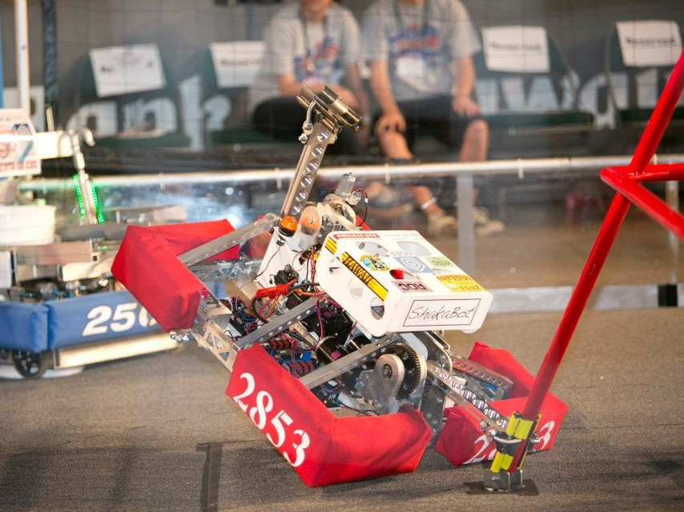

  

Manoa Dojo is a website I helped create in the Fall 2016 semester for ICS 314, software engineering.  Before the semester started, I knew absolutely nothing about web development.  We learned Javascript, html, and Meteor Framework over the two months.  For a six-week period spanning from October to December, a group of three other students and I built the website from scratch, using the tools we learned earlier in the semester.

The Manoa Dojo website was designed as a place for students to meetup and form study groups.  While this makes forming a study group convenient, can still be very hit-or-miss, because students might not know anything about the subject.  Thus, for every study session there is a sensei.  A sensei is the primary leader of the study group, that can assist other study group users, or the grasshoppers.  This sensei-grasshopper relationship is why the website was named Manoa-Dojo.

For more information on Manoa Dojo, you can visit the project page <a href=https://manoa-dojo.github.io/>here<a>.  The website was hosted on Galaxy, but the free subscription has ended.  If you still want to see how the app runs, you can watch the tutorial, or visit the devloper's guide on the project page.