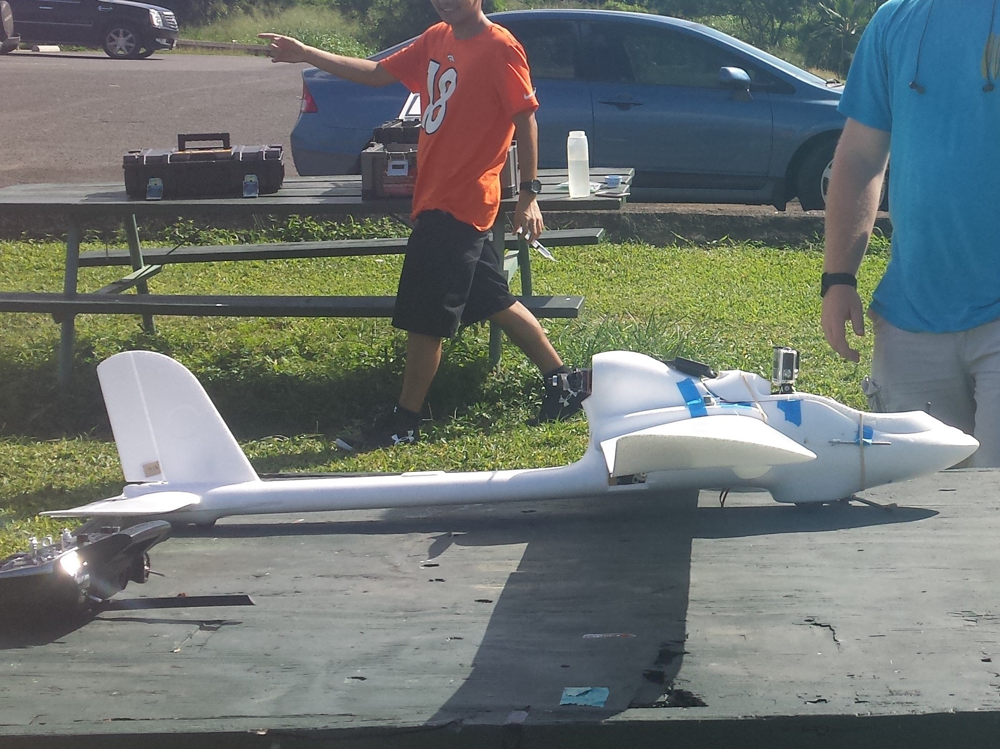

VIP UHDT was founded by two undergraduate students in Spring of 2014.  Since then, it has blossomed into a multi-disciplinary team of eighteen students, with different majors and grade levels.  I joined the team in Spring 2015, my second year of college, as a requirement for sophomore project, and I have stayed with the project since.  I intend to continue this project until Spring 2017, when I will be graduating from the University of Hawaii.

Our team competes in an annual competition known as the Association for Unmanned Vehicle Systems International Student Unmanned Aerial Systems (AUVSI SUAS) Competition.  The goal of the competition is to complete in various search and rescue tasks.  These tasks include finding alphanumeric targets on the ground, flying to waypoints, avoiding virtual objects, and delivering an air drop.

I am the main image processing person on my team.  I am tasked with locating the aforementioned targets and identifying their characteristics and geolocation.  In the 2016 academic year, the first year we competed in the AUVSI SUAS Competition, our team focused on creating a system that met the minimum requirements.  The main achievement from last year was the synthesis of an accurate geotagging formula.  Our geotagging formula was accurate within 50-75 feet.  Our team went to the AUVSI SUAS Competition in Maryland in June of 2016, and finished tied for 17th of the 68 teams registered.

This year, the goal for image processing is to have in-flight autonomous target detection and classification.  Our proposed system has an onboard camera that takes pictures, and sends to the onboard Raspberry Pi, which processes the images for target characteristics and target geolocation.  A sample target, seen below, has five characteristics, which are shape, color, alphanumeric symbol, alphanumeric symbol color, and alphanumeric symbol orientation.  The project is still ongoing, and due for completion in May 2017.

VIP UHDT is also a writing intensive project, with Preliminary Design Reviews, Critical Design Reviews, and a 20-page Journal Paper.  In total, I have estimate I've written over 20 pages of technical documentation, and finished around 10 technical presentations.

You can learn more about the AUVSI competiton at the [AUVSI Compeition Page](http://www.auvsi-suas.org/).  For more information on the project, you can contact me at Smau4@hawaii.edu and I would be happy to answer any questions.

